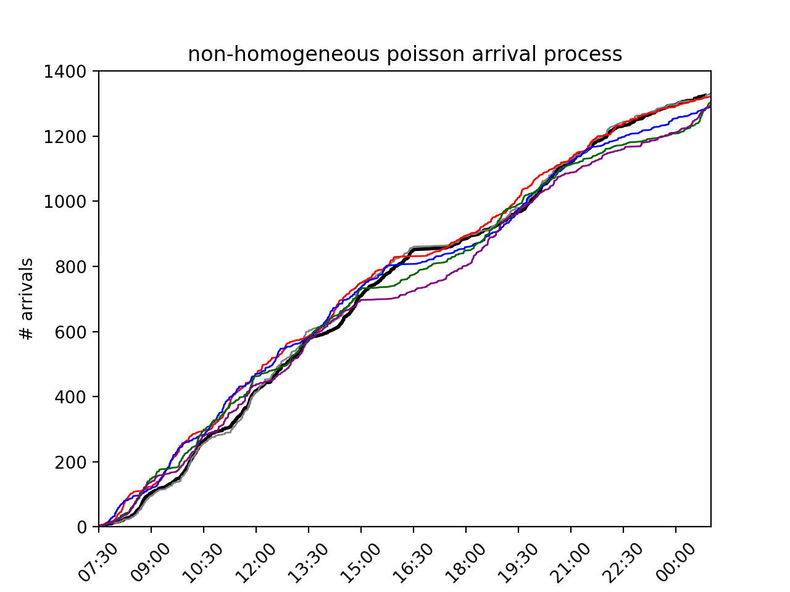

```{r setup, include=FALSE}
knitr::opts_chunk$set(echo = TRUE)
```

## 1. MSQ Summary

Multiple Server Queueing model(MSQ) is a natural extension of Single
Server Queueing model(SSQ) and it is fairly important in both
theoretical and practical side of the next-event simulation.

Like the general structure we have seen in the SSQ model, MSQ system(or
service node) also consists of a queue but instead a set of parallel
servers that connect to it waiting for incoming tasks. For each server,
the state can be either busy or idle and queue's state will be
empty(otherwise nonempty) if at least one server is idle.

The first important update here is in the QueueStats class--where the
server-level statistics are added as lists so that we can track the
stats/status of each parallel server like: whether server $s_i$ is busy
or not, how many jobs have completed, etc.

The second distinction is we should employ a server selection rule when
new-entered job find more than one server is idle. The rule source code
implemented is LRU--Least Recent Used algorithm which select the server
with longest idle time. Also, after we select the appropriate server, we
will engage the selected server, generate the service time, and schedule
a completion of service event.

The third update is on event-type algorithms. Although the events are
still the same(arrival of customers and completion of services), the
methods we incorporated should include the parameters of selected server
index given by new algorithms above so we can properly schedule the
events and update the simulation clock.

It is worth to notice that we still implemented the MSQ model based on
the Simulus library so we can keep track of the simulation calendar.

## 2. Parametric Input Modeling using MOM

We first load in the simEd library and store the arrival times and
service times collected.

```{r}
#Library load-in
library(simEd)

# grab the arrival data and service data as collected by University of Richmond
# students for Tyler's Grill
arr <- tylersGrill$arrivalTimes
svc <- tylersGrill$serviceTimes

open_time  = 0     # 07:30
close_time = 48600 # 21:30

ten_am =  9000     # 10:00
one_pm = 19800     # 13:00

```

Before we using the parametric model fit, we need to check the
independence and stationarity.

```{r}
# determine whether service times are independent
acf(svc)

# determine whether service times are from a stationary process
# (i.e., rate doesn't change) -- check via fitting a linear
# model
observations = 1:length(svc)
fit <- lm(svc ~ observations)  # order: dependent variable ~ independent variable
plot(svc ~ observations)
abline(fit)

# 
slope <- fit$coefficients[2]
print(paste("slope of linear fit:", slope))
```

Because the service times are deemed to be independent (no
autocorrelation beyond lag 0) and from a stationary process (service
times versus observation number returns a fitted regression line with
slope 0), we now proceed to use method of moments (MOM) to fit both a
gamma distribution and a lognormal distribution.

### a) Gamma Distribution

We know that the gamma distribution has two parameters: shape ($k$) and
scale ($\theta$). first, set sample mean to theoretical mean of gamma
($k\theta$), and set sample variance to theoretical variance of gamma
($k\theta^2$). So we have the following equations:

```{=tex}
\begin{align}
 \bar{x} &= k \theta \\
  s^2  &= k \theta^2
\end{align}
```
There are two equations with two unknowns (k, theta), so we can first
solve k: \begin{align*}
k = \bar{x}/\theta
\end{align*}

and substituting into the second equation we can get: \begin{align*}
s^2   &= (\bar{x} / \theta) \theta ^2 \\
       &= \bar{x}\theta \\
 \theta &= \frac{s^2}{\bar{x}}
\end{align*}

and again substituing back into the first equation: \begin{align*}
k &= \frac{\bar{x}}{\theta} \\
&= \frac{\bar{x}}{\frac{s^2}{\bar{x}}} \\
&= \frac{\bar{x}^2}{s^2}
\end{align*}

Hence, our estimators for k and theta will be: \begin{align}
\hat{k}    &= \frac{\bar{x}^2}{s^2} 
= \frac{\overline{svc}^2}{ s_{svc} }\\
\hat{\theta} &= \frac{s^2}{\bar{x}}
= \frac{s_{svc}} { \overline{svc}}
\end{align}

```{r}
k_hat = mean(svc)^2 / var(svc)
theta_hat = var(svc) / mean(svc)
print(paste("MOM parameter estimates when fitting gamma (k,theta):", 
            k_hat, theta_hat))
```

### b) Lognormal Distribution

We know that Lognormal distribution has two parameters as well: $\mu$
and $\sigma$. And the the natural logarithm of X: $\ln{(X)}$ is normally
distributed with mean $\mu$ and variance $\sigma ^{2}$.

So we have following equations: \begin{align}
\overline{\ln{(x)}} &=\mu \\
s_{\ln{(x)}}^2 &= \sigma^2
\end{align}

Thus, the estimator of two parameters for normal distribution is
straightforward: \begin{align}
\hat{\mu} &= \overline{\ln{(svc)}}\\
\hat{\sigma} &= \sqrt{s_{\ln{(svc)}}}
\end{align}

```{r}
mu_hat = mean(log(svc))
sigma_hat = sqrt(var(log(svc)))
print(paste("MOM parameter estimates when fitting lognarmal (mu,sigma):", 
            mu_hat, sigma_hat))
```

### fitting curves and KS tests

```{r}
#Gamma
plot.stepfun(ecdf(svc), pch = "", main = "gamma CDF fit to service ECDF")
curve(pgamma(x, shape = k_hat, scale = theta_hat), col = "red", 
       lwd = 2, add = TRUE)

ks_fit_gamma <- ks.test(svc, "pgamma", shape = k_hat, scale = theta_hat)
print(paste("K-S measure for gamma goodness of fit:", ks_fit_gamma$statistic))
# add the fit statistic to the graphic
text(150, 0.3, paste("ks.test D statistic:", 
                    format(ks_fit_gamma$statistic, digits = 4)))

#   (d) Again, the K-S test should not be used when there are
#       ties in the data, so we can remedy this by adding a small amount of
#       noise to each service time, and noting that the produced D value is
#       essentially the same as before:
svc_with_noise <- svc + runif(length(svc), 0.001, 0.002)

k_hat_noise = mean(svc_with_noise)^2 / var(svc_with_noise)
theta_hat_noise = var(svc_with_noise) / mean(svc_with_noise)
print(paste("MOM parameter estimates when fitting gamma (k,theta), with noise:", 
            k_hat_noise, theta_hat_noise))
ks_fit_gamma_check <- ks.test(svc_with_noise, 
                        "pgamma", shape = k_hat_noise, scale = theta_hat_noise)
print(paste("K-S measure for gamma goodness of fit (with noise):", 
        ks_fit_gamma_check$statistic))
```

```{r}
#Lognormal
plot.stepfun(ecdf(svc), pch = "", main = "Lognormal CDF fit to service ECDF")
curve(plnorm(x, meanlog = mu_hat, sdlog = sigma_hat), col = "red", 
       lwd = 2, add = TRUE)

ks_fit_lnorm <- ks.test(svc, "plnorm", meanlog = mu_hat, sdlog = sigma_hat)
print(paste("K-S measure for lognormal goodness of fit:", ks_fit_lnorm$statistic))
# add the fit statistic to the graphic
text(150, 0.3, paste("ks.test D statistic:", 
                    format(ks_fit_lnorm$statistic, digits = 4)))

#   (d) Again, the K-S test should not be used when there are
#       ties in the data, so we can remedy this by adding a small amount of
#       noise to each service time, and noting that the produced D value is
#       essentially the same as before:

mu_hat_noise = mean(log(svc_with_noise))
sigma_hat_noise = sqrt(var(log(svc_with_noise)))
print(paste("MOM parameter estimates when fitting gamma (k,theta), with noise:", 
            mu_hat_noise, sigma_hat_noise))
ks_fit_lnorm_check <- ks.test(svc_with_noise, 
                        "plnorm", meanlog = mu_hat_noise, sdlog = sigma_hat_noise)
print(paste("K-S measure for gamma goodness of fit (with noise):", 
        ks_fit_lnorm_check$statistic))
```

As we can observe from graphics and test statistics above, lognormal
distribution is the better fitting distribution for service time's
empirical cumulative distribution function. So we can update the
getService() function in MSQ model with Lognormal distributed service
time.

## Extending Algorithm 9.3.3

pseudo-code for updated algorithm:

last_arrival= get(f.last_arrival) 
i = 1; 
Ei = Exponential(1.0); 
if (Ei<= n / k) { 
m = (n + 1) \* k \* Ei / n; 
Ti = t(m) + (t(m+1) - t(m))\* (((n + 1) \* k \* Ei / n) - m); 
interarrival= Ti-last_arrival 
i = i +1; 
Ei = Ei-1 + Exponential(1.0); } 
return interarrival;

Below is the graphical evidence that shows the consistency of
non-parametric modeling on arrival process.



## 4. Experimentation and batch of means

### Data import

```{r}
library(readr)
sojourn_times_100000 <- read_csv("~/Desktop/Bates College/Bates Course/DCS 307 Simulation/Simulation/Final Problem Set/sojourn_times_100000.csv")
View(sojourn_times_100000)

sojourn_times_100000_2 <- read_csv("~/Desktop/Bates College/Bates Course/DCS 307 Simulation/Simulation/Final Problem Set/sojourn_times_100000.csv")

sojourn_times_100000_3 <- read_csv("~/Desktop/Bates College/Bates Course/DCS 307 Simulation/Simulation/Final Problem Set/sojourn_times_100000.csv")

sojourn_times_100000_4 <- read_csv("~/Desktop/Bates College/Bates Course/DCS 307 Simulation/Simulation/Final Problem Set/sojourn_times_100000.csv")

sojourn_times_100000_5 <- read_csv("~/Desktop/Bates College/Bates Course/DCS 307 Simulation/Simulation/Final Problem Set/sojourn_times_100000.csv")
```

### batch of means

```{r}
sojourn_times<-sojourn_times_100000$`sojourn time`
b<-2048
warm_up<-1024
num_jobs<-length(sojourn_times)
n<-num_jobs/b
sojourns<-sojourn_times[-(1:warm_up)]
batch_means<-numeric(n)
for(j in 1:n) {
  batch<-sojourns[(1:b)+(b*(j-1))]
  batch_means[j]<-mean(batch)
}
ci<-t.test(batch_means, conf.level=0.95)
```

```{r}
sojourn_times<-sojourn_times_100000_2$`sojourn time`
b<-2048
warm_up<-1024
num_jobs<-length(sojourn_times)
n<-num_jobs/b
sojourns<-sojourn_times[-(1:warm_up)]
batch_means<-numeric(n)
for(j in 1:n) {
  batch<-sojourns[(1:b)+(b*(j-1))]
  batch_means[j]<-mean(batch)
}
ci2<-t.test(batch_means, conf.level = 0.95)
```

```{r}
sojourn_times<-sojourn_times_100000_3$`sojourn time`
b<-2048
warm_up<-1024
num_jobs<-length(sojourn_times)
n<-num_jobs/b
sojourns<-sojourn_times[-(1:warm_up)]
batch_means<-numeric(n)
for(j in 1:n) {
  batch<-sojourns[(1:b)+(b*(j-1))]
  batch_means[j]<-mean(batch)
}
ci3<-t.test(batch_means, conf.level = 0.95)

```

```{r}
sojourn_times<-sojourn_times_100000_4$`sojourn time`
b<-2048
warm_up<-1024
num_jobs<-length(sojourn_times)
n<-num_jobs/b
sojourns<-sojourn_times[-(1:warm_up)]
batch_means<-numeric(n)
for(j in 1:n) {
  batch<-sojourns[(1:b)+(b*(j-1))]
  batch_means[j]<-mean(batch)
}
ci4<-t.test(batch_means, conf.level = 0.95)
```

```{r}
sojourn_times<-sojourn_times_100000_5$`sojourn time`
b<-2048
warm_up<-1024
num_jobs<-length(sojourn_times)
n<-num_jobs/b
sojourns<-sojourn_times[-(1:warm_up)]
batch_means<-numeric(n)
for(j in 1:n) {
  batch<-sojourns[(1:b)+(b*(j-1))]
  batch_means[j]<-mean(batch)
}
ci5<-t.test(batch_means, conf.level = 0.95)
```

### ploting confidence intervals and sample means

```{r}
plot(NA, NA, xlim=c(1, 5), ylim=c(66.3, 68), ylab="b=30", xlab="experimentation",
bty = "n", xaxt = "n", las = 1, main="Confidence interval of average sojourn time(n=5, MAX_arrival=100000)")
axis(side=1, at=seq(1, 5, by=1))
#axis(side=2, at=seq(66.5, 67.5, by=0.1))
segments(1, ci$conf.int[1], 1, ci$conf.int[2], col="red")
points(1, ci$estimate, lwd=3)
segments(2, ci2$conf.int[1], 2, ci2$conf.int[2], col="red")
points(2, ci2$estimate, lwd=3)
segments(3, ci3$conf.int[1], 3, ci3$conf.int[2], col="red")
points(3, ci3$estimate, lwd=3)
segments(4, ci4$conf.int[1], 4, ci4$conf.int[2], col="red")
points(4, ci4$estimate, lwd=3)
segments(5, ci5$conf.int[1], 5, ci5$conf.int[2], col="red")
points(5, ci5$estimate, lwd=3)
```

For this problem, we utilize the power of both Python and R in doing
experimentation and statistical analysis of average sojourn time of
customers in the multiple server queuing system. We first use
implemented model in msq.py to generate sojourn times for all arrived
customers and save the data into .csv file. Then we use and import the
data into R and apply the batch of means method to produce desired
confidence intervals for average sojourn time of 10000 arrived
customers. From the plot above, we can guess that true average sojourn
time is between 67 to 67.5. To get a better picture we need to adding
more experimentation to obtaining the simulated sojourn time data here.

## 5. Summary Discussion

In experimenting with msq model, we first begin with max_arrival=100000
and 5 server in total. And from the printed stats, we find that average
waiting time for each job is about 6 mins(sounds reasonable). But if we
go back to 4 servers scenario, we found that the system get too crowded
where average wait time can go up to 14 mins. So the choice of servers
is dynamic because it depends on the specific capacity of your system.
